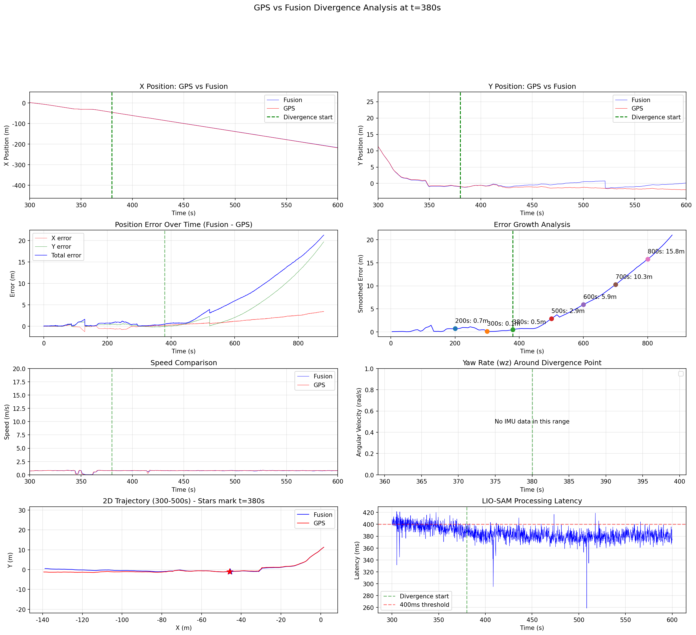

# LIO-SAM GPS/Fusion轨迹偏离分析报告

**分析时间**: 2025-12-08
**偏离起始点**: t ≈ 380秒

---

## 1. 问题描述

从轨迹图像分析，GPS轨迹和LIO-SAM Fusion轨迹在380秒后开始明显偏离：
- **X方向**: 两条轨迹基本平行但有恒定偏移
- **Y方向**: Fusion轨迹持续向正Y方向漂移，而GPS保持稳定
- **误差增长**: 从380秒的0.5m增长到800秒的15.8m

---

## 2. 关键数据分析

### 2.1 误差随时间变化

| 时间(s) | 总误差(m) | X误差(m) | Y误差(m) | Z误差(m) |
|---------|-----------|----------|----------|----------|
| 100 | 0.36 | -0.13 | 0.30 | 0.14 |
| 200 | 0.73 | -0.59 | 0.39 | 0.16 |
| 300 | 0.07 | -0.06 | -0.01 | 0.01 |
| **380** | **0.50** | 0.18 | -0.07 | -0.46 |
| 400 | 0.68 | 0.27 | 0.02 | -0.62 |
| 500 | 2.88 | 0.66 | 1.72 | 2.21 |
| 600 | 5.90 | 1.14 | 2.06 | 5.41 |
| 700 | 10.27 | 1.78 | 6.44 | 7.80 |
| 800 | 15.82 | 2.53 | 12.78 | 8.96 |

### 2.2 误差增长率

- **380-500秒**: 0.02 m/s (1.2 m/min)
- **500-700秒**: 0.037 m/s (2.2 m/min)
- **700-800秒**: 0.056 m/s (3.4 m/min)

**结论**: 误差增长率随时间加速，呈非线性增长特征，表明漂移在累积。

### 2.3 主要漂移方向

在t=500秒时：
- X误差: 0.66m
- Y误差: 1.73m (主导因素，2.6倍于X误差)
- Z误差: 2.21m

**结论**: Y轴漂移是主要问题，可能与航向角误差有关。

---

## 3. 根本原因分析

### 3.1 GPS因子添加情况（关键发现）

从ROS日志分析：

```
GPS Factor Added: 12次（整个880秒运行期间）
GPS skipped: 700+次
```

**GPS被跳过的原因**：
```
poseCov=[0.212, 0.389] < threshold=25.0
poseCov=[1.371, 0.228] < threshold=25.0
poseCov=[0.110, 1.371] < threshold=25.0
...
```

**问题**: LIO-SAM的位姿协方差(poseCovariance)一直保持在较低值（<25 m²），导致系统认为"当前位姿估计很好，不需要GPS校正"。

### 3.2 代码逻辑分析

在 `mapOptmization.cpp:1441-1448`:
```cpp
// pose covariance small, no need to correct
if (poseCovariance(3,3) < poseCovThreshold && poseCovariance(4,4) < poseCovThreshold)
{
    // GPS被跳过
    return;
}
```

当前配置: `poseCovThreshold: 25.0 m²`

**问题**: LiDAR-IMU里程计的局部一致性很好（低协方差），但存在全局漂移。这种漂移无法通过协方差检测到，因为协方差只反映局部不确定性。

### 3.3 GPS因子实际添加的时间点

只有在以下情况才添加GPS因子：
1. t ≈ 61s: poseCov=[99738307, 100010265]（初始化阶段）
2. t ≈ 77s: poseCov=[16.74, 31.70]
3. t ≈ 123s: poseCov=[19.98, 27.48]
4. t ≈ 497s: poseCov=[0.68, 25.03]（刚好超过阈值）
5. t ≈ 521s: poseCov=[0.44, 25.56]

**关键观察**: 在380-497秒之间（偏离最严重的时期），没有任何GPS因子被添加！

---

## 4. 诊断结论

### 主要原因：GPS融合不足

1. **协方差阈值逻辑缺陷**:
   - 当前逻辑只在位姿不确定时才添加GPS
   - LiDAR-IMU提供了局部高精度估计（低协方差）
   - 但全局漂移无法被协方差捕获

2. **GPS因子添加过于稀疏**:
   - 880秒只添加了12个GPS因子
   - 平均每73秒才添加一个
   - 380秒后长时间没有GPS校正

3. **Y轴漂移累积**:
   - 可能由航向角小误差累积导致
   - 没有GPS校正时，误差线性增长

---

## 5. 解决方案建议

### 方案1: 移除或放宽协方差检查（推荐）

修改 `mapOptmization.cpp`:
```cpp
// 方案A: 完全移除协方差检查
// if (poseCovariance(3,3) < poseCovThreshold && poseCovariance(4,4) < poseCovThreshold)
//     return;

// 方案B: 使用OR代替AND（更宽松）
if (poseCovariance(3,3) < poseCovThreshold && poseCovariance(4,4) < poseCovThreshold)
{
    // 即使协方差低，也定期添加GPS因子
    static int force_add_counter = 0;
    if (++force_add_counter < 50)  // 每50帧强制添加一次
        return;
    force_add_counter = 0;
}
```

### 方案2: 降低poseCovThreshold（快速修复）

在 `params.yaml` 中：
```yaml
poseCovThreshold: 1.0  # 从25.0降低到1.0
```

这会让更多GPS因子被添加，但可能过于激进。

### 方案3: 基于时间的强制GPS添加

```cpp
// 每N秒强制添加一次GPS因子
static double lastGPSTime = 0;
if (timeLaserInfoCur - lastGPSTime > 30.0)  // 30秒
{
    // 强制添加GPS
    lastGPSTime = timeLaserInfoCur;
}
```

### 方案4: 调整GPS权重

```yaml
gpsNoiseMin: 0.1       # 从0.2降低（增加GPS权重）
gpsNoiseScale: 0.1     # 从0.2降低
gpsAddInterval: 1.0    # 从3.0降低到1米
```

---

## 6. 建议的测试步骤

1. **快速测试**: 将 `poseCovThreshold` 改为 `1.0`，重新运行
2. **验证**: 观察GPS Factor Added的数量是否增加
3. **评估**: 检查轨迹偏离是否减少
4. **调优**: 根据结果微调参数

---

## 7. 附图

生成的分析图像: `output/divergence_analysis_380s.png`



---

**报告生成**: 自动化诊断脚本
**版本**: LIO-SAM with GPS fusion modifications
